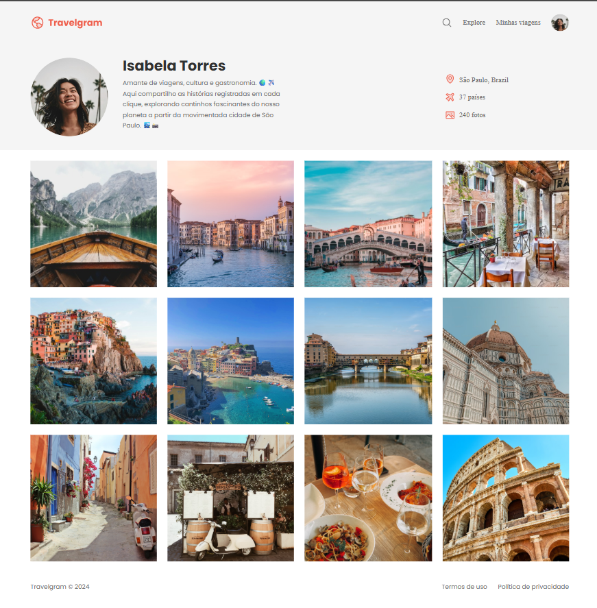

# 📸 Travelgram 

Projeto desenvolvido com HTML e CSS, simulando um perfil de viagens estilo rede social. 

---

## 🚀 Sobre o projeto
 O projeto foi desenvolvido para praticar:
 - Estruturação HTML semântica
 - Flexbox
 - CSS Grid
 - Organização de arquivos
 - Responsividade
 - Posicionamento de elementos

--- 

## 🎨 Layout


---

## 🛠️ Tecnologias utilizadas
- HTML5
- CSS3

---

## 📚 Aprendizados
Durante o desenvolvimento desse projeto pratiquei: 
✔️ Organização de código
✔️ Componentização do CSS
✔️ Alinhamentos com Flexbox
✔️ Criação de galerias com Grid
✔️ Estrutura semântica
✔️ Boas práticas de front-end

---

## 💻 Como executar
Clone o repositório:

```bash
https://github.com/LudmilaMonteiro/Perfil-viagens.git
```

Depois abra o arquivo:
```bash
index.html
```

---

## 📄 Licença

Este projeto está licenciado sob a Licença MIT — você pode usar, modificar e distribuir livremente.

Para mais detalhes, consulte o arquivo `LICENSE`.

---

## 👨‍💻 Autor

Feito com 💜 por Ludmila Monteiro
